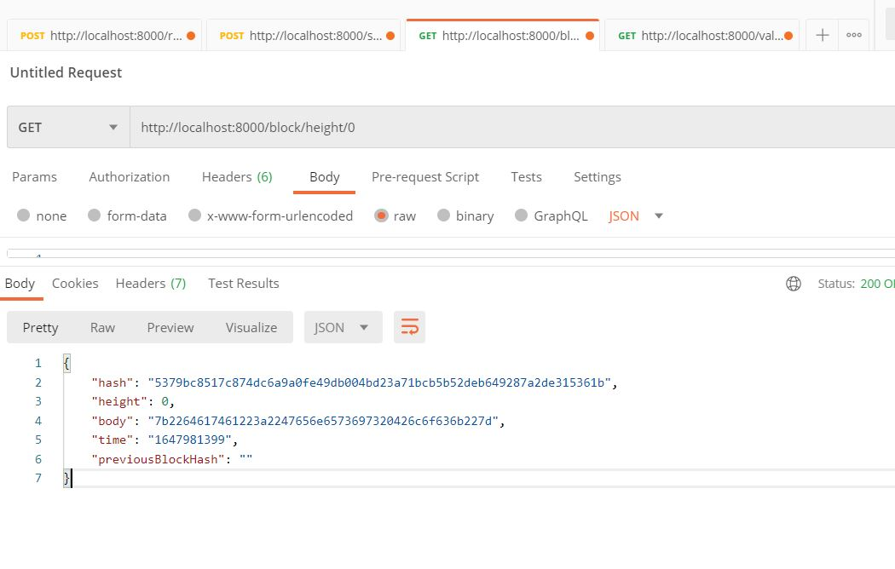
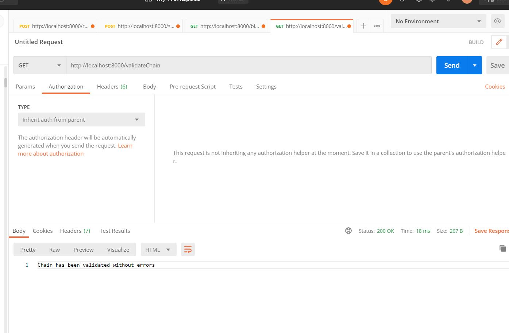
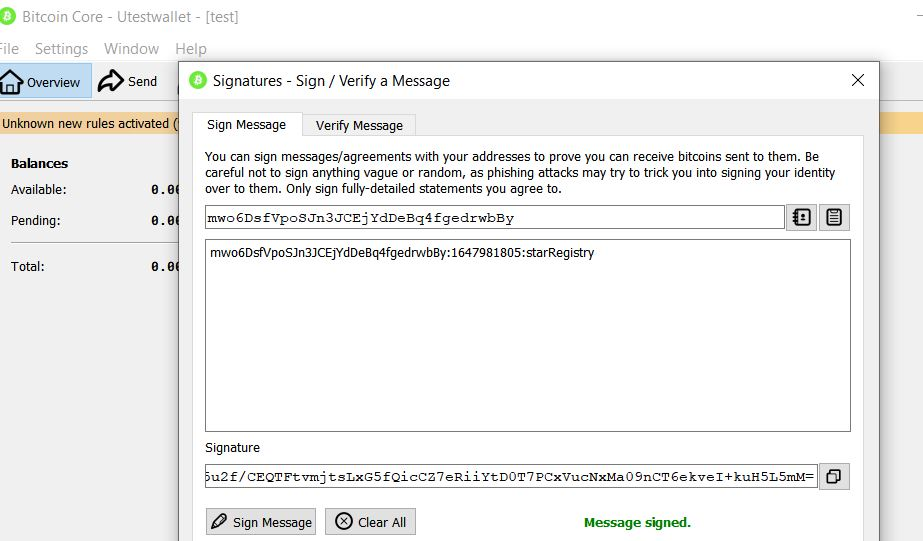
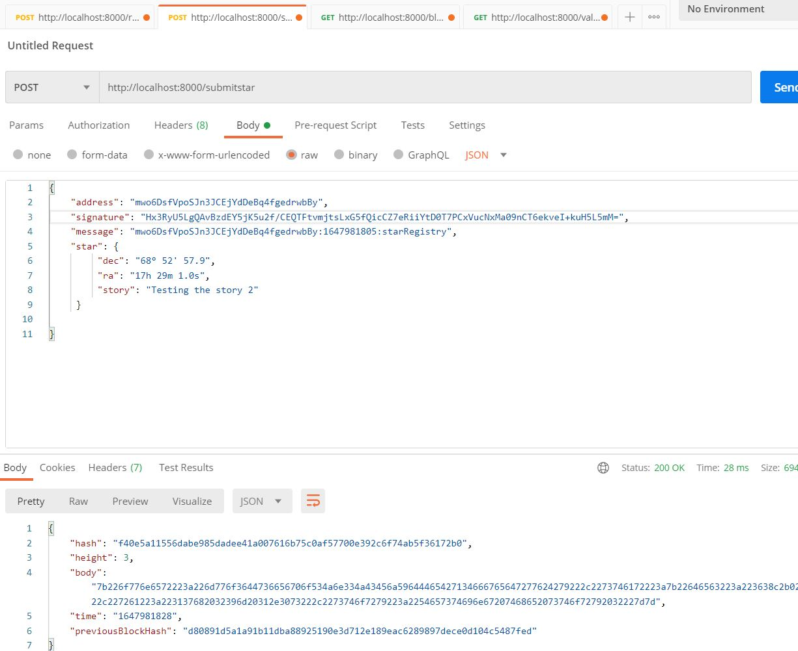
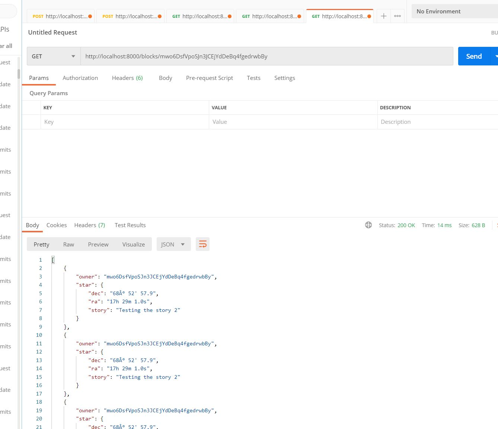

# Private Blockchain Application

In this project I have implemented a private blockchain with a given boilerplate code with a REST Api already setup.

## Case: Star Notary Private Blockchain application

Your employer is trying to make a test of concept on how a Blockchain application can be implemented in his company.
He is an astronomy fans and he spend most of his free time on searching stars in the sky, that's why he would like
to create a test application that will allows him to register stars, and also some others of his friends can register stars
too but making sure the application know who owned each star.

### Implementation requirements of the application

1. The application will create a Genesis Block when we run the application.
2. The user will request the application to send a message to be signed using a Wallet and in this way verify the ownership over the wallet address. The message format will be: `<WALLET_ADRESS>:${new Date().getTime().toString().slice(0,-3)}:starRegistry`;
3. Once the user have the message the user can use a Wallet to sign the message.
4. The user will try to submit the Star object for that it will submit: `wallet address`, `message`, `signature` and the `star` object with the star information.
    The Start information will be formed in this format:
    ```json
        "star": {
            "dec": "68° 52' 56.9",
            "ra": "16h 29m 1.0s",
            "story": "Testing the story 4"
		}
    ```
5. The application will verify if the time elapsed from the request ownership (the time is contained in the message) and the time when you submit the star is less than 5 minutes.
6. If everything is okay the star information will be stored in the block and added to the `chain`
7. The application will allow us to retrieve the Star objects belong to an owner (wallet address). 


## What tools or technologies

- This application has been created using Node.js and Javascript programming language. The architecture uses ES6 classes.
- Visual Studio Code as an IDE 
- Some of the libraries or npm modules you will use are:
    - "bitcoinjs-lib": "^4.0.3",
    - "bitcoinjs-message": "^2.0.0",
    - "body-parser": "^1.18.3",
    - "crypto-js": "^3.1.9-1",
    - "express": "^4.16.4",
    - "hex2ascii": "0.0.3",
    - "morgan": "^1.9.1"
    Remember if you need install any other library you will use `npm install <npm_module_name>`

Libraries purpose:

1. `bitcoinjs-lib` and `bitcoinjs-message`. Those libraries will help us to verify the wallet address ownership, we are going to use it to verify the signature.
2. `express` The REST Api created for the purpose of this project it is being created using Express.js framework.
3. `body-parser` this library will be used as middleware module for Express and will help us to read the json data submitted in a POST request.
4. `crypto-js` This module contain some of the most important cryotographic methods and will help us to create the block hash.
5. `hex2ascii` This library will help us to **decode** the data saved in the body of a Block.

## Boilerplate instructions
### Understanding the code

The Boilerplate code is a simple architecture for a Blockchain application, it includes a REST APIs application to expose the your Blockchain application methods to your client applications or users.

1. `app.js` file. It contains the configuration and initialization of the REST Api, the team who provide this boilerplate code suggest do not change this code because it is already tested and works as expected.
2. `BlockchainController.js` file. It contains the routes of the REST Api. Those are the methods that expose the urls you will need to call when make a request to the application.
3. `src` folder. In here we are going to have the main two classes we needed to create our Blockchain application, we are going to create a `block.js` file and a `blockchain.js` file that will contain the `Block` and `BlockChain` classes.

### Starting with the boilerplate code:

First thing first, download or clone the boilerplate code:
Download link: [Udacity Project 1 starter code](https://video.udacity-data.com/topher/2021/October/61673884_project-1-v2-boilerplate/project-1-v2-boilerplate.zip) 


Then we need to install all the libraries and module dependencies, to do that: open a terminal and run the command `npm install`

**( Remember to be able to work on this project you will need to have installed in your computer Node.js and npm )**

At this point we are ready to run our project for first time, use the command: `node app.js`

You can check in your terminal the the Express application is listening in the PORT 8000

## Implementation methods

1. `block.js` file. In the `Block` class I have implemented the following methods:
    `validate()`: validate if the block has been tampered or not.
      *  Note: to access the class values inside a Promise code you need to create an auxiliary value `let self = this;`
2.  `getBData()`: auxiliary method to return the block body (decoding the data)
3.  `_addBlock(block)`: _addBlock(block) will store a block in the chain
4. `requestMessageOwnershipVerification(address)`: allows to request a message that you will use to  sign it with your Bitcoin Wallet (Electrum or Bitcoin Core)
5. `submitStar(address, message, signature, star)`: allows users to register a new Block with the star object into the chain. This method will resolve with the Block added or reject with an error.
6. `getBlockByHash(hash)`: returns the Block, with the hash passed as a parameter.  Search on the chain array for the block that has the hash.
7.  `getStarsByWalletAddress (address)`: returns an array of Stars objects existing in the chain and are belongs to the owner with the wallet address passed as parameter.
8. `validateChain()`: returns the list of errors when validating the chain.
    
## Test your application functionalities

To test the application I have used POSTMAN, to make the requests to the API.

1. Run your application using the command `node app.js`
You should see in your terminal a message indicating that the server is listening in port 8000:
> Server Listening for port: 8000

2. Tests screenshots to make sure your application is working fine:
    
3. Make your first request of ownership sending your wallet address:
    
4. Sign the message with your Wallet:
    
5. Submit your Star
     
6. Retrieve Stars owned by me
    